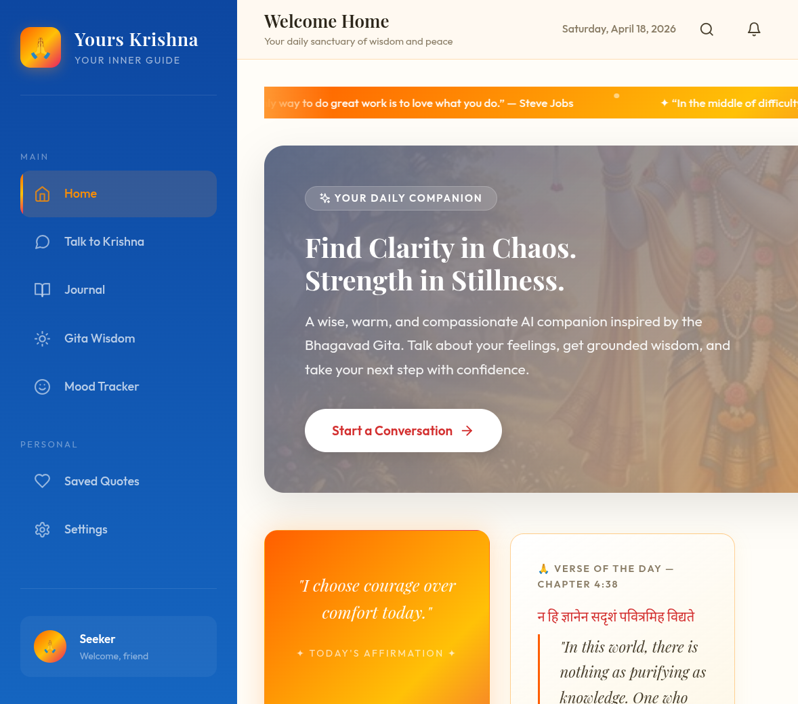
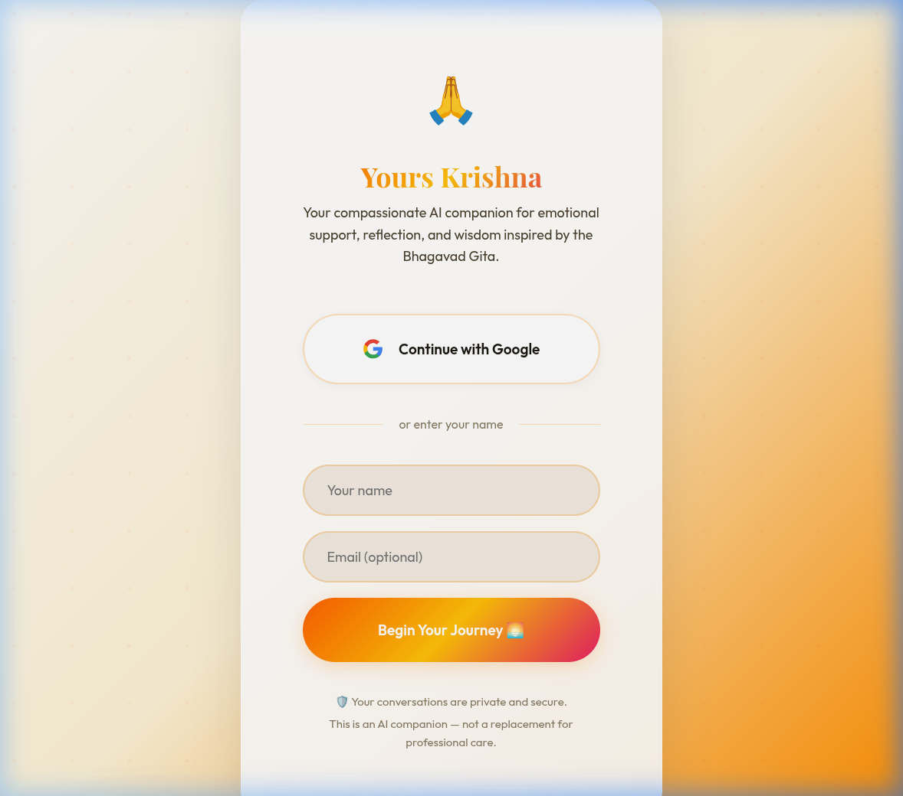

# Yours Krishna 🪷

Yours Krishna is a deeply spiritual, Lord Krishna-inspired AI companion web application. Built with React and designed with a visually rich, meditative Bhagavad Gita aesthetic (vibrant deep midnight blues and ascetic saffron), this application brings the wisdom of the Gita into a modern, continuous chat interface with stunning lotus animations.



## Features ✨

- **Immersive Spiritual Chat**: Seek guidance, ask for clarity, or just find peace with Krishna's wisdom. Powered seamlessly by OpenRouter's live LLMs.
- **Deep Midnight Cosmic Theme**: Features exact carefully chosen hex codes to build a breathtakingly serene and loving visual atmosphere.
- **Glowing Lotus Burst Animations**: Experience gentle, spiritually resonant visual cues and floating lotuses when Krishna speaks to you.
- **Smart Authentication System**: Supports Google Auth via Firebase natively, but automatically degrades into a **magical seamless Mock-Auth** using `localStorage` if your Firebase keys are missing, allowing anyone to try out the app instantly without setup!

---

## Getting Started

### 1. Installation

Clone the repository and install the NPM packages:

```bash
git clone https://github.com/your-username/yours-krishna.git
cd yours-krishna
npm install
```

### 2. Setting Up API Keys & The `.env`

To keep your application secure, **API keys are not pushed to this repository.** You will need to generate your own keys and insert them into the environment variables.

1. Create a copy of the example environment file:
   ```bash
   cp .env.example .env
   ```

2. Open the `.env` file in your editor. You will see several variables you can populate.

#### OpenRouter Configuration (Required for continuous AI Chat)
The AI is powered freely by OpenRouter endpoints.
* Go to [OpenRouter.ai](https://openrouter.ai/)
* Create an account and navigate to your API Keys.
* Generate a key and paste it as `VITE_OPENROUTER_API_KEY=your-key-here`.

#### Firebase Configuration (Required ONLY for real Google Auth)
The app will completely seamlessly mock the login flow without Firebase. But if you want real auth:
* Go to the [Firebase Console](https://console.firebase.google.com/)
* Create a Web App and enable "Google Sign-In" inside Authentication.
* Paste your config credentials into the `VITE_FIREBASE_*` variables.

### 3. Start the Dev Server
```bash
npm run dev
```

Visit `http://localhost:3000` to begin your journey. 🙏

---



### Design & Architecture
The system employs `lucide-react` for beautiful minimalism, `react-router-dom` for fluid navigation between the Wisdom Library, Journals, and Chat, and is fundamentally styled using Vanilla CSS to ensure maximum performance while handling deep keyframe animations. The deep blues (`#031525`) contrast beautifully across the spiritual UI layout.

*Dharma protects those who protect it.*
